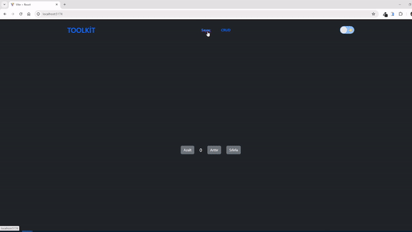
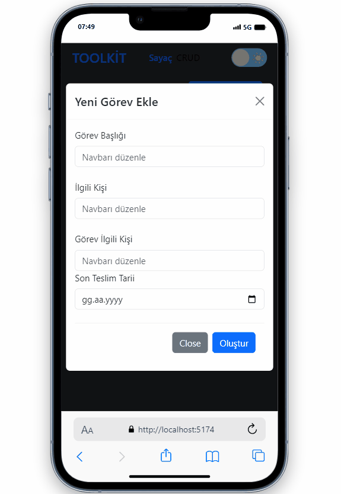

# Bu mini crud uygulamasıyla Redux toolkit ile çalışmanın nasıl daha kolay ve verimli olacağı incelendi

# React Toolkit

- Klasik reduxa göre daha az kod yazarak aynı sonucu elde edebiliyoruz.

- Dahili olarak thunk paketi içerir. ve bundan kaynaklı hazır bir thunk fonkisyonu ile beraber Thunk kullanımını kolaylaştırıyor

- Devtools eklentisi sayesinde proje geliştirirken storu reducerları dispatch edilen actionları anlık izleyebiliriz.Geniş kapsamlı projelerde hata yönetimi ve state yönetimi kolaylaşıyor

# Toolkit kurlumu 

- npm i @reduxjs/toolkit

- npm i react-redux

- create store and reducers

# Slice 

- Klasik Reduxta actionsları, actiyontype nesne dosyasını ve reducerları ayrı dosylarda tutuyorduk.Toolkitle beraber oluşturduğumuz slice  dosyası ile her bir reducer ve aksiyonda tekrar eden kodların önüne geçip Normal reduxa göre hem daha az kod yazıp hemde tek noktada yönetebilecek yapıyı oluşturduk

- Toolkit ile birlikte slice içerisinde  state'de tutulan herhangi bir veriyi doğrudan güncelleyebiliyoruz.Örneğin bir dizideki elemanı güncellememiz gerektiğinde map yerine Splice  ekleme gerektiğinde  concat yerine push gibi daha pratik metotlar kullanabiliriz

# Ekran Görüntüsü

